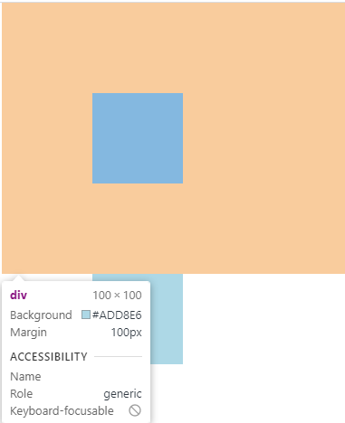
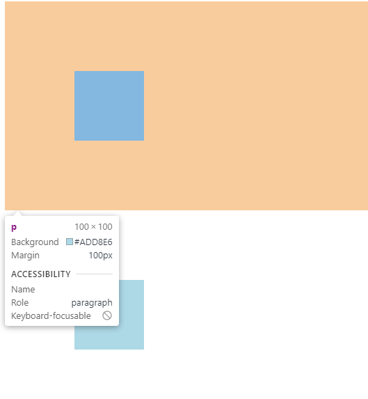
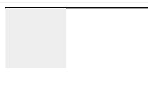
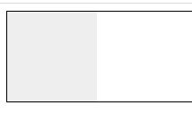
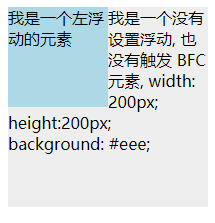
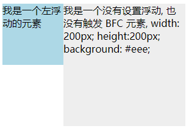

## 一、BFC 概念

Formatting context(格式化上下文) 是 W3C CSS2.1 规范中的一个概念。它是页面中的一块渲染区域，并且有一套渲染规则，它决定了其子元素将如何定位，以及和其他元素的关系和相互作用。

那么 BFC 是什么呢？

BFC 即 Block Formatting Contexts (块级格式化上下文)，它属于上述定位方案的普通流。

**具有 BFC 特性的元素可以看作是隔离了的独立容器，容器里面的元素不会在布局上影响到外面的元素，并且 BFC 具有普通容器所没有的一些特性。
**

通俗一点来讲，可以把 BFC 理解为一个封闭的大箱子，箱子内部的元素无论如何翻江倒海，都不会影响到外部。


## 二、触发 BFC

只要元素满足下面任一条件即可触发 BFC 特性：

- body 根元素
- 浮动元素：float 除 none 以外的值
- 绝对定位元素：position (absolute、fixed)
- display 为 inline-block、table-cells、flex
- overflow 除了 visible 以外的值 (hidden、auto、scroll)

## 三、BFC 特性及应用

### **1. 同一个 BFC 下外边距会发生折叠**

```html
<head>
div{
    width: 100px;
    height: 100px;
    background: lightblue;
    margin: 100px;
}
</head>
<body>
    <div></div>
    <div></div>
</body>
```



因为两个 div 元素都处于同一个 BFC 容器下 (这里指 body 元素) 所以第一个 div 的下边距和第二个 div 的上边距发生了重叠，所以两个盒子之间距离只有 100px，而不是 200px。

注意：这不是css 的bug，而是一种规范，**如果想要避免外边距的重叠，可以将其放在不同的 BFC 容器中。**

```html
<div class="container">
    <p></p>
</div>
<div class="container">
    <p></p>
</div>
.container {
    overflow: hidden;
}
p {
    width: 100px;
    height: 100px;
    background: lightblue;
    margin: 100px;
}
```

这时候，两个盒子边距就变成了 200px



### **2. BFC 可以包含浮动的元素（清除浮动）**

浮动的元素会脱离普通文档流，导致无法撑开父元素

```css
 .f_box {
   border: 1px solid #000;
}
.child_box {
   width: 100px;
   height: 100px;
   background: #eee;
   float: left;
}
```

```html
 <div class="f_box">
      <div class="child_box"></div>
    </div>
```

由于容器内元素浮动，脱离了文档流，所以容器只剩下 2px 的边距高度。



如果使触发容器的 BFC，那么容器将会包裹着浮动元素。



### **3. BFC 可以阻止元素被浮动元素覆盖**

文字环绕效果

```html
<div style="height: 100px;width: 100px;float: left;background: lightblue">我是一个左浮动的元素</div>
<div style="width: 200px; height: 200px;background: #eee">我是一个没有设置浮动, 
也没有触发 BFC 元素, width: 200px; height:200px; background: #eee;</div>
```



这时候其实第二个元素有部分被浮动元素所覆盖，(但是文本信息不会被浮动元素所覆盖) 如果想避免元素被覆盖，可触第二个元素的 BFC 特性，在第二个元素中加入 **overflow: hidden**，就会变成：




原文来源:[BFC](https://zhuanlan.zhihu.com/p/25321647)