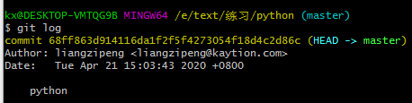
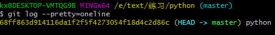

当多次提交提交的时候，当发现提交错误时，需要版本回退

当然了，在实际工作中，我们脑子里怎么可能记得一个几千行的文件每次都改了什么内容，不然要版本控制系统干什么。版本控制系统肯定有某个命令可以告诉我们历史记录，在Git中，我们用`git log`命令查看：



<!--more-->

`git log`命令显示从最近到最远的提交日志，我们可以看到3次提交

最近的一次是`append GPL`，上一次是`add distributed`，最早的一次是`wrote a readme file`

若是嫌弃输出信息太多后，可以加上`--pretty=oneline`参数：



上述的一串类似`68ff863d`的是commit 的版本号，通过版本号可以得知是哪一个版本

当知道版本后，可以通过reset来实现版本回退

```
$ git reset --hard HEAD^
HEAD is now at e475afc add distributed
```

`HEAD`代表的是当前版本，^代表的是上一个版本

当然也可以通过版本号来实现版本回退

```
$ git reset --hard 1094a
HEAD is now at 83b0afe append GPL
```

Git的版本回退速度非常快，因为Git在内部有个指向当前版本的`HEAD`指针，当你回退版本的时候，Git仅仅是把HEAD从指向`append GPL`：

```ascii
┌────┐
│HEAD│
└────┘
   │
   └──> ○ append GPL
        │
        ○ add distributed
        │
        ○ wrote a readme file
```

改为指向`add distributed`：

```ascii
┌────┐
│HEAD│
└────┘
   │
   │    ○ append GPL
   │    │
   └──> ○ add distributed
        │
        ○ wrote a readme file
```

小结

- `HEAD`指向的版本就是当前版本，因此，Git允许我们在版本的历史之间穿梭，使用命令`git reset --hard commit_id`。
- 穿梭前，用`git log`可以查看提交历史，以便确定要回退到哪个版本。
- 要重返未来，用`git reflog`查看命令历史，以便确定要回到未来的哪个版本。


原文链接：[Git简介](https://www.liaoxuefeng.com/wiki/896043488029600/896067008724000)