## 前置环境

1. npm更新到最新

2. node >=8.9 版本

3. 全局安装了vue-cli

   ```nginx
    npm install -g @vue/cli
   ```

4. 安装了vue

<!--more-->

## 创建项目步骤

1.在新建的文件夹下创建项目 vue create my-project

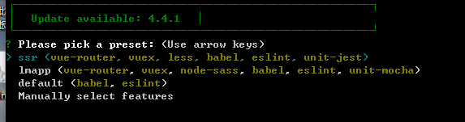

指向的是ssr是因为上次配置过的cli3的配置，第一次执行create是没有的

通过键盘上下键可以切换选项，也可以选默认(default)，也可以选择手动(Manally),如果选择default，那个一直回车就好了

当然了需求不同，往往需要手动配置

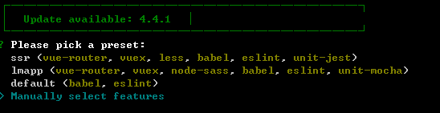


2.手动配置的配置信息

按照个人项目需求，选择需要的配置

注意，空格是选中和取消，A键是全选

TypeScript 支持使用 TypeScript 书写源码

 Progressive Web App (PWA) Support PWA 支持。

 Router 支持 vue-router 。

Vuex 支持 vuex 。

CSS Pre-processors 支持 CSS 预处理器。

 Linter / Formatter 支持代码风格检查和格式化。

 Unit Testing 支持单元测试。

 E2E Testing 支持 E2E 测试。

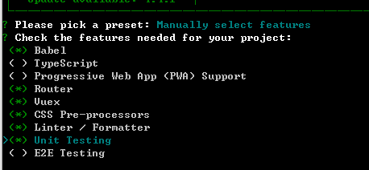

以上是我搭建Vue项目的配置信息


3.当选了Router后会询问是否采用history，当然基本都是用的

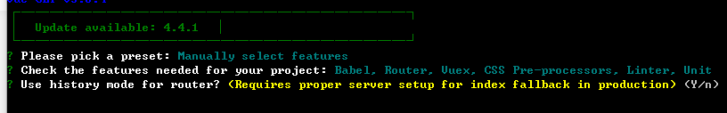


4.css的预处理

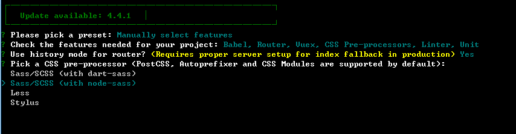

我选了Sass


5.我选择的是ESLint + Prettier

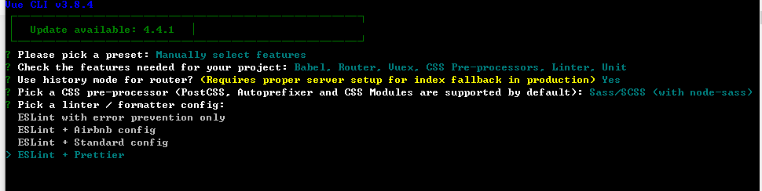


6.选择语法检查方式

我自己选择保存就检测
第一个是保存检测，第二个是fix和commit的时候检测

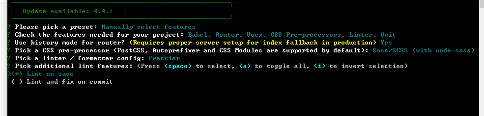


7.单元测试，我选择了Mocha

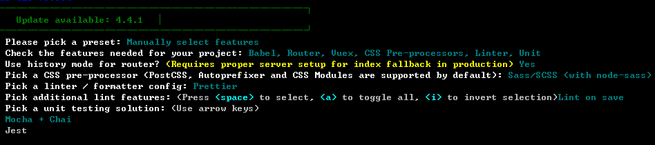


8.配置文件存放地方
第一个是独立文件夹位置，第二个是在package.json文件里

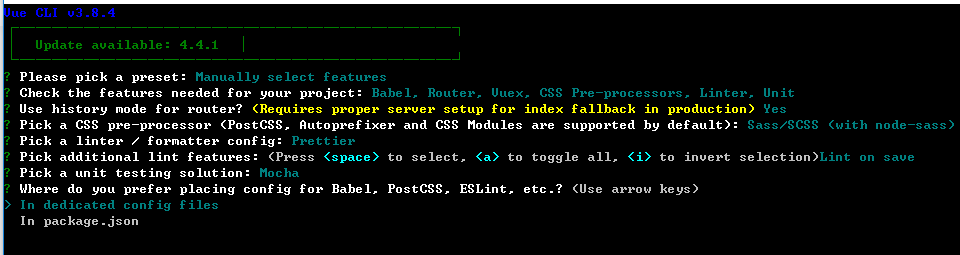

9.询问是否记录这一次的配置，以便下次使用，如一开始的时候会显示的vuecli3配置

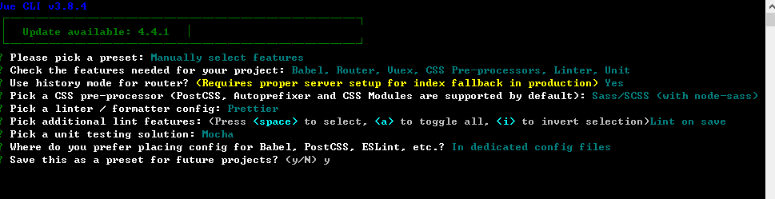

10.回车确定等待下载

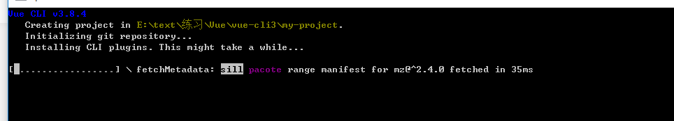


11.下载后就可以启动和编写

```javascript
cd my-project
npm run serve
```

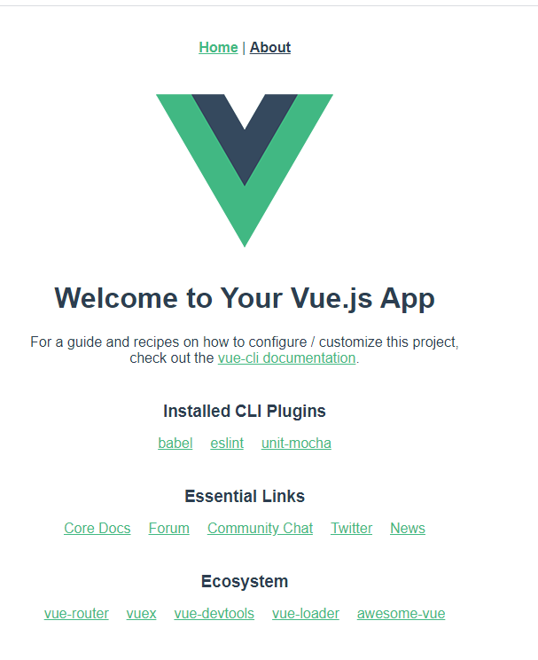


12.vue-cli3.0的目录结构相比2.0而言要简介许多，没有了build和config等文件，当需要其他配置的时候需要自己去配置，比如说webpack配置

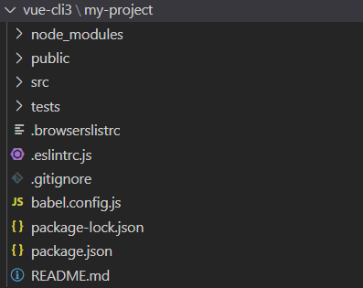


原文来自：[vue-cli3快速创建项目](https://www.jianshu.com/p/5e13bc2eb97c)