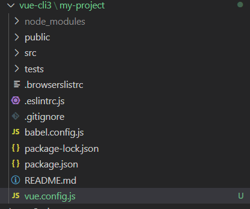

> **vue-cli3 脚手架搭建完成后，项目目录中没有 vue.config.js 文件，需要手动创建**


## 创建vue.config.js

vue.config.js 是一个可选的配置文件，如果项目的 (和 package.json 同级的) 根目录中存在这个文件，那么它会被 @vue/cli-service 自动加载。你也可以使用 package.json 中的 vue 字段，但是注意这种写法需要你严格遵照 JSON 的格式来写。

<!--more-->

在根目录中创建 **vue.config.js**




## **vue.config.js配置**

这个文件应该导出一个包含了选项的对象：


### **配置选项**

#### **publicPath** 

> Type: string
>
> Default: '/'
>
> 部署应用包时的基本 URL， 用法和 webpack 本身的 output.publicPath 一致。
>
> 这个值也可以被设置为空字符串 ('') 或是相对路径 ('./')，这样所有的资源都会被链接为相对路径，这样打出来的包可以被部署在任意路径。


把开发服务器架设在根路径，可以使用一个条件式的值：

```javascript
module.exports = {
    //选项
    //基本路径
    publicPath: process.env.NODE_ENV === 'production' ? '/production-sub-path' : '/'

}
```


#### **outputDir**

> Type: string
>
> Default: 'dist'
>
> 输出文件目录，当运行 vue-cli-service build 时生成的生产环境构建文件的目录。注意目标目录在构建之前会被清除 (构建时传入 --no-clean 可关闭该行为)。


#### **assetsDir**

> Type: string
>
> Default: ''
>
> 放置生成的静态资源 (js、css、img、fonts) 的目录。


**注：**从生成的资源覆写 filename 或 chunkFilename 时，assetsDir 会被忽略。


#### **indexPath**

> Type: string
>
> Default: 'index.html'
>
> 指定生成的 index.html 的输出路径 (相对于 outputDir)。也可以是一个绝对路径。


#### **filenameHashing**

Type: boolean

Default: true

默认情况下，生成的静态资源在它们的文件名中包含了 hash 以便更好的控制缓存。然而，这也要求 index 的 HTML 是被 Vue CLI 自动生成的。如果你无法使用 Vue CLI 生成的 index HTML，你可以通过将这个选项设为 false 来关闭文件名哈希。


#### **pages**

> Type: Object
>
> Default: undefined
>
> 在 multi-page（多页）模式下构建应用。每个“page”应该有一个对应的 JavaScript 入口文件。

其值应该是一个对象，对象的 key 是入口的名字，value 是：一个指定了 entry, template, filename, title 和 chunks 的对象 (除了 entry 之外都是可选的)，或一个指定其 entry 的字符串。


**注：**当在 多页应用 模式下构建时，webpack 配置会包含不一样的插件 (这时会存在多个 html-webpack-plugin 和 preload-webpack-plugin 的实例)。如果你试图修改这些插件的选项，请确认运行 vue inspect。


#### **lintOnSave**

> Type: boolean | 'error'
>
> Default: true
>
> 是否在保存的时候使用 `eslint-loader` 进行检查。 有效的值：`ture` | `false` | `"error"` 当设置为 `"error"` 时，检查出的错误会触发编译失败。


#### **runtimeCompiler**

> Type: boolean
>
> Default: false
>
> 是否使用包含运行时编译器的 Vue 构建版本。设置为 true 后你就可以在 Vue 组件中使用 template 选项了，但是这会让你的应用额外增加 10kb 左右。


#### **transpileDependencies**

> Type: Array<string | RegExp>
>
> Default: []
>
> 默认情况下 babel-loader 会忽略所有 node_modules 中的文件。如果你想要通过 Babel 显式转译一个依赖，可以在这个选项中列出来。


#### **productionSourceMap**

> Type: boolean
>
> Default: true
>
> 如果你不需要生产环境的 source map，可以将其设置为 false 以加速生产环境构建。


#### **crossorigin**

> Type: string
>
> Default: undefined
>
> 设置生成的 HTML 中 <link rel="stylesheet"> 和 <script> 标签的 crossorigin 属性。


#### **integrity**

> Type: boolean
>
> Default: false
>
> 在生成的 HTML 中的 <link rel="stylesheet"> 和 <script> 标签上启用 [Subresource Integrity](https://links.jianshu.com/go?to=https%3A%2F%2Fdeveloper.mozilla.org%2Fen-US%2Fdocs%2FWeb%2FSecurity%2FSubresource_Integrity) (SRI)。如果你构建后的文件是部署在 CDN 上的，启用该选项可以提供额外的安全性。


### **Webpack相关配置**

#### **configureWebpack**

> Type: Object | Function
>
> 如果这个值是一个对象，则会通过 [webpack-merge](https://links.jianshu.com/go?to=https%3A%2F%2Fgithub.com%2Fsurvivejs%2Fwebpack-merge) 合并到最终的配置中。
>
> 如果这个值是一个函数，则会接收被解析的配置作为参数。该函数及可以修改配置并不返回任何东西，也可以返回一个被克隆或合并过的配置版本。


#### **chainWebpack**

> Type: Function
>
> 是一个函数，会接收一个基于 [webpack-chain](https://links.jianshu.com/go?to=https%3A%2F%2Fgithub.com%2Fmozilla-neutrino%2Fwebpack-chain) 的 ChainableConfig 实例。允许对内部的 webpack 配置进行更细粒度的修改。


### **Css相关配置**


#### **css.modules**

> Type: boolean
>
> Default: false
>
> 默认情况下，只有 *.module.[ext] 结尾的文件才会被视作 CSS Modules 模块。设置为 true 后你就可以去掉文件名中的 .module 并将所有的 *.(css|scss|sass|less|styl(us)?) 文件视为 CSS Modules 模块。


#### **css.extract**

> Type: boolean | Object
>
> Default: 生产环境下是 true，开发环境下是 false
>
> 是否将组件中的 CSS 提取至一个独立的 CSS 文件中 (而不是动态注入到 JavaScript 中的 inline 代码)。


#### **css.sourceMap**

> Type: boolean
>
> Default: false
>
> 是否为 CSS 开启 source map。设置为 true 之后可能会影响构建的性能。


#### **css.loaderOptions**

> Type: Object
>
> Default: {}
>
> 向 CSS 相关的 loader 传递选项。

支持的 loader 有：

> [css-loader](https://links.jianshu.com/go?to=https%3A%2F%2Fgithub.com%2Fwebpack-contrib%2Fcss-loader)
>
> [postcss-loader](https://links.jianshu.com/go?to=https%3A%2F%2Fgithub.com%2Fpostcss%2Fpostcss-loader)
>
> [sass-loader](https://links.jianshu.com/go?to=https%3A%2F%2Fgithub.com%2Fwebpack-contrib%2Fsass-loader)
>
> [less-loader](https://links.jianshu.com/go?to=https%3A%2F%2Fgithub.com%2Fwebpack-contrib%2Fless-loader)
>
> [stylus-loader](https://links.jianshu.com/go?to=https%3A%2F%2Fgithub.com%2Fshama%2Fstylus-loader)


**parallel**

> Type: boolean
>
> Default: require('os').cpus().length > 1
>
> 是否为 Babel 或 TypeScript 使用 thread-loader。该选项在系统的 CPU 有多于一个内核时自动启用，仅作用于生产构建。

pwa

> Type: Object
>
> 向 [PWA 插件](https://links.jianshu.com/go?to=https%3A%2F%2Fgithub.com%2Fvuejs%2Fvue-cli%2Ftree%2Fdev%2Fpackages%2F%40vue%2Fcli-plugin-pwa)传递选项。

**pluginOptions**

> Type: Object
>
> 这是一个不进行任何 schema 验证的对象，因此它可以用来传递任何第三方插件选项。


### 配置webpack-dev-server

#### **devServer**

> Type: Object
>
> [所有 webpack-dev-server 的选项](https://links.jianshu.com/go?to=https%3A%2F%2Fwebpack.js.org%2Fconfiguration%2Fdev-server%2F)都支持。注意：
>
> 有些值像 host、port 和 https 可能会被命令行参数覆写。
>
> 有些值像 publicPath 和 historyApiFallback 不应该被修改，因为它们需要和开发服务器的 [publicPath](https://links.jianshu.com/go?to=https%3A%2F%2Fcli.vuejs.org%2Fzh%2Fconfig%2F%23baseurl) 同步以保障正常的工作。


#### **devServer.proxy**

> Type: string | Object
>
> 如果你的前端应用和后端 API 服务器没有运行在同一个主机上，你需要在开发环境下将 API 请求代理到 API 服务器。这个问题可以通过 vue.config.js 中的 devServer.proxy 选项来配置。


### 具体代码

```javascript
module.exports = {
    //选项
    //基本路径
    publicPath: '/',
    //构建式的输出目录
    outputDir: 'dist',
    //放置静态资源的目录
    assetsDir: 'static',
    //html的输出路径
    indexPath: 'index.html',
    //文件名哈希
    filenameHashing: true,
    //用于配置多页面配置，默认是undefined
    pages: {
        index: {
            //page的入口文件
            entry: 'src/index/main.js',
            //模板文件
            template: 'public/index.html',
            //dist/index.html的输出文件
            filename: 'index.html',
            //当使用页面 title选项时
            //template中的title标签需要时<title><%= htmlWebpackPlugin.options.title%></title>
            title: 'Index Page',
            //在这个页面中包含的块，默认情况下会包含
            //提取出来的通用chunk和vendorchunk
            chunks: ['chunk-vendors', 'chunk-common', 'index']
        },
        //当使用只有入口的字符串格式时
        //模板文件默认是`public/subpage.html`
        //如果不存在，就回退到'public/index.html'
        //输出文件默认是`subpage.html`
        subpage: 'src/subpage/main.js'
    },
    //是否在保存的时候使用'eslint-loader' 进行检查
    lintOneSave: true,
    //是否使用带有浏览器内编译器的完整构建版本
    runtimeCompiler: false,
    //配置路由
    devServer: {
        open: process.platform === 'darwin',
        host: '0.0.0.0',
        port: 8080,
        https: false,
        hotOnly: false,
        //配置代理
        proxy: {
            '/api': {
                target: 'http:www.mirenol.com',
                changeOrigin: true,
                secure: false,
                pathRewrite: {
                    '^/api': ''
                }
            },
            '/foo': {
                target: '<other_url>'
            }
        },
        before: app => {}
    }
}
```


原文链接：[vue.config.js 配置](https://www.jianshu.com/p/b358a91bdf2d) 