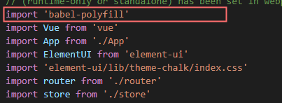
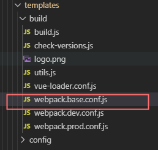
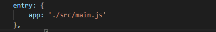
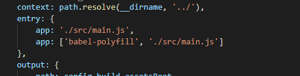

> ​	背景：由于Vue中使用了ES6语法，因此低版本的IE浏览器是不兼容IE的，在vue不做适配的情况下，vue所生成的网页用IE浏览器中打开只会出现一片空白，因此要用到使用**babel-polyfill**转换成ES5

<!--more-->		

#### 安装**@babel/polyfill**

​	通过npm安装,代码如下

```npm
	npm install --save babel-polyfill
```


#### 配置main.js文件

​	注意：引入是必须放在main.js引入中的最前面，是最前面

​		如图下所示

​			

​	否则是无法应用babel-polyfill


#### 在index.html中配置IE的兼容（非必要）

```html
<meta http-equiv="X-UA-Compatible" content="IE=edge,chrome=1">
```


#### 最后在config中修改webpack.base.conf.js配置

​	有些工程师喜欢在建立vue项目的时候将webpack抛出，形成一个build文件，

webpack.base.conf.js 就在该文件中



配置如下：

​	未替换换前的配置



​	替换后的配置

​	


步骤到目前就可以实现vue的项目在IE的运行了。

