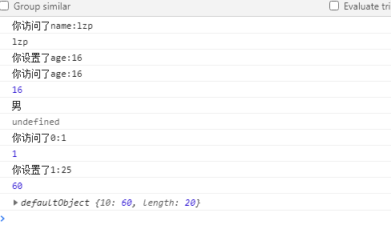
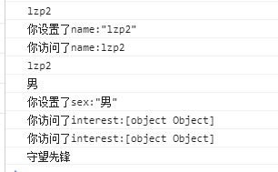

# 深入响应性原理

vue3.0放弃了Object.defineProperty，并 采用了Proxy来实现响应式的功能。

vue2.0是使用Object.defineProperty来监控数据的变化的，其原理是通过发布者和订阅者（ getter/setter ）让 Vue 能够追踪依赖，在 property 被访问和修改时通知变更。

但是这种方式具有极大的局限性，由于 JavaScript 的限制，Vue **不能检测**数组和对象的变化。

- 对于对象 无法监听对象的删除和添加
- 对于数组 利用索引直接设置一个数组项以及修改数组的长度时无法检测到数组的变化

最新的 Proxy，相比 vue2 的 Object.defineProperty，能达到速度加倍、内存减半的成效。

<!--more-->

## Object.defineProperty

举个简单的实例

```js
 class defaultObject {
        constructor(data) {
          for (const key of Object.keys(data)) {
            //判断该项是否为对象，如果是，那么就继续往下遍历
            if (typeof data[key] == "object") {
              data[key] = new defaultObject(data[key]);
            }
            Object.defineProperty(this, key, {
              //当且仅当该属性的 configurable 键值为 true 时，该属性的描述符才能够被改变，同时该属性也能从对应的对象上被删除。
              configurable: true,
              //当且仅当该属性的 enumerable 键值为 true 时，该属性才会出现在对象的枚举属性中。
              enumerable: true,
              get() {
                console.log(`你访问了${key}:${data[key]}`);
                return data[key];
              },
              set(val) {
                console.log(`你设置了${key}:${val}`);
                data[key] = val;
              },
            });
          }
        }
      }
      //对象
      let obj = {
        name: "lzp",
        age: "18",
      };
      const person = new defaultObject(obj);
      console.log(person.name);
      person.age = 16;
      console.log(person.age);
	//无法监听到对象的添加
      person.sex = "男";
      console.log(person.sex);
//无法监听到对象的删除
      delete person.name;
      console.log(person.name);
      //数组
      const arr = [1, 3, 64, 10];
      const arr2 = new defaultObject(arr);
      console.log(arr2[0]);
      arr2[1] = 25;
      arr2[10] = 60;
      console.log(arr2[10]);
      arr2.length = 20;
      console.log(arr2);
```

结果



不止如此，Object.defineProperty通过遍历所有的属性，当数据量一大起来，加载速度就无比的慢。

还有，由于Object.defineProperty是监听所有属性的变化，那么如果数据量巨大的话，所占的内存也会无比的多


## **Proxy** 

**Proxy** 对象用于创建一个对象的代理，从而实现基本操作的拦截和自定义（如属性查找、赋值、枚举、函数调用等）。

也就是无论访问对象的什么属性，之前定义的或是新增的属性，都会走到拦截中进行处理。这就解决了之前所无法监听的问题

### 语法

```js
const p = new Proxy(target, handler)
```

#### 参数

- **target**：要使用 `Proxy` 包装的目标对象（可以是任何类型的对象，包括原生数组，函数，甚至另一个代理）。
- **handler**：一个通常以函数作为属性的对象，各属性中的函数分别定义了在执行各种操作时代理 `p` 的行为。

举个例子

```js
      let obj2 = {
        name: "lzp",
        interest: {
          game: "lol",
          move: "钢铁侠",
        },
      };
      const p = new Proxy(obj2, {
        get(target, prop, receiver) {
          //   track(target, prop);
          //   console.log(arguments);
          console.log(`你访问了${prop}:${target[prop]}`);
          return Reflect.get(...arguments);
        },
        set(target, key, value, receiver) {
          console.log(value);
          console.log(`你设置了${key}:${JSON.stringify(value)}`);
          Reflect.set(...arguments);
        },
      });
      p.name = "lzp2";
      console.log(p.name);
      p.sex = "男";
      p.interest.game = "守望先锋";
      console.log(p.interest.game);
```

结果



由上可知，新增或编辑属性，并不需要重新添加响应式处理，都能监听的到
因为 Proxy 是对对象的操作，只要你访问对象，就会走到 Proxy 的逻辑中


## 区别

Proxy 和 Object.defineProperty 的使用方法看似很相似，其实 Proxy 是在更高维度上去拦截属性的

**Object.defineProperty**

Vue2 中，对于给定的 data：如 { count: 1 }，是需要根据具体的 key 也就是 count，去对 get 和 set 进行拦截，也就是：

```
Object.defineProperty(data, 'count', {
  get() {},
  set() {},
})
```

必须预先知道要拦截的 key 是什么，这也就是为什么 Vue2 里对于对象上的新增属性无能为力，所以 Vue 初始化的过程中需要遍历 data 来挟持数据变化，造成速度变慢，内存变大的原因

监听对象设置或删除属性时，一般使用 `this.$set()` 、`this.$delete()` 来监听


**Proxy**

而 Vue3 所使用的 Proxy，则是这样拦截的：

```
new Proxy(data, {
  get(key) { },
  set(key, value) { },
})
```

可以看到，proxy 不需要关心具体的 key，它去拦截的是 修改 data 上的任意 key 和 读取 data 上的任意 key
所以，不管是已有的 key 还是新增的 key，都会监听到
但是 Proxy 更加强大的地方还在于 Proxy 除了 get 和 set，还可以拦截更多的操作符，具体可看 [MDN](https://developer.mozilla.org/zh-CN/docs/Web/JavaScript/Reference/Global_Objects/Proxy)


## Reflect

**Reflect** 是一个内置的对象，它提供拦截 JavaScript 操作的方法。这些方法与proxy handlers的方法相同， `Reflect`不是一个函数对象，因此它是不可构造的。

比较有用的三个方法

#### **`Reflect.get()`**

​	与从 对象 (`target[propertyKey]`) 中读取属性类似，但它是通过一个函数执行来操作的。

```js
Reflect.get(target, propertyKey[, receiver])
```

参数：

- **target** --需要取值的目标对象
- **propertyKey** --需要获取的值的键值
- **receiver**--如果`target`对象中指定了`getter`，`receiver`则为`getter`调用时的`this`值。

```js
// Object
var obj = { x: 1, y: 2 };
Reflect.get(obj, "x"); // 1 等同于 obj['x']

// Array
Reflect.get(["zero", "one"], 1); // "one" 

// Proxy with a get handler
var x = {p: 1};
var obj = new Proxy(x, {
  get(t, k, r) { return k + "bar"; }
});
Reflect.get(obj, "foo"); // "foobar"
```

#### **`Reflect.set()`**

就像在一个对象上设置一个属性。

```js
Reflect.set(target, propertyKey, value[, receiver])
```

参数：

- **target** --设置属性的目标对象。
- **propertyKey** --设置的属性的名称。
- **value**--设置的值。
- **receiver**--如果`target`对象中指定了`getter`，`receiver`则为`getter`调用时的`this`值。

返回值：返回一个 `Boolean`值表明是否成功设置属性。

```js
// Object
var obj = {};
Reflect.set(obj, "prop", "value"); // true
obj.prop; // "value"

// Array
var arr = ["duck", "duck", "duck"];
Reflect.set(arr, 2, "goose"); // true
arr[2]; // "goose"

// It can truncate an array.
Reflect.set(arr, "length", 1); // true
arr; // ["duck"];

// With just one argument, propertyKey and value are "undefined".
var obj = {};
Reflect.set(obj); // true
Reflect.getOwnPropertyDescriptor(obj, "undefined");
// { value: undefined, writable: true, enumerable: true, configurable: true }
```

#### **`Reflect.has()`**

作用与 `in` 操作符相同。

```js
Reflect.has(target, propertyKey)
```

参数：

- **target**--目标对象.

- **propertyKey**--属性名，需要检查目标对象是否存在此属性。

  

返回值：返回一个 `Boolean`类型的对象指示是否存在此属性。

```js
Reflect.has({x: 0}, "x"); // true
Reflect.has({x: 0}, "y"); // false

// 如果该属性存在于原型链中，返回true 
Reflect.has({x: 0}, "toString");

// Proxy 对象的 .has() 句柄方法
obj = new Proxy({}, {
  has(t, k) { return k.startsWith("door"); }
});
Reflect.has(obj, "doorbell"); // true
Reflect.has(obj, "dormitory"); // false
```


原文来源 [Vue3 为何使用 Proxy 实现数据监听](https://ainyi.com/93)