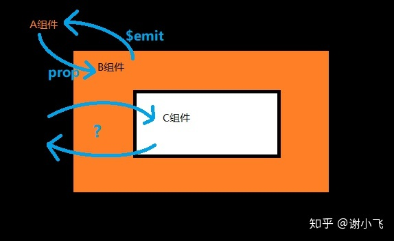

<!--more-->		

## prop/$emit

父组件：通过`prop`的方式向子组件传递数据

子组件：通过`$emit`可以向父组件通信。

```js
//Parent.vue
<template>
  <div>
    当前选中：{{ current }}
    <Child :list="list" @change="changeCurrent"></Child>
  </div>
</template>
<script>
import Child from "./child";
export default {
  data() {
    return {
      current: 0,
      list: ["红楼梦", "水浒传", "三国演义", "西游记"]
    };
  },
  components: { Child },
  methods: {
    changeCurrent(num) {
        //监听子组件传过来的数据
      this.current = num;
    }
  }
};
</script>
```

```js
//Child.vue
<template>
  <div>
    <template v-for="(item, index) in list">
      <div @click="clickItem(index)" :key="index">{{ item }}</div>
    </template>
  </div>
</template>
<script>
export default {
  props: {
    list: {
      type: Array,
      default: () => {
        return [];
      }
    }
  },
  methods: {
    clickItem(index) {
      this.$emit("change", index);
    }
  }
};
</script>
```

优点：

​	传值取值方便简洁明了

缺点：

1. 由于数据是单向传递，如果子组件需要改变父组件的props值每次需要给子组件绑定对应的监听事件。
2. 如果父组件需要给孙组件传值，需要子组件进行转发，较为不便。

## .sync修饰符

在子组件能够直接修改父组件的prop值

`vue1.x` 时，曾作为双向绑定功能存在，即子组件可以修改父组件中的值

`vue2.0`时，违反了单向数据流的设计理念--删除

`vue2.3.0+`是，重新引入，作为一个编译时的语法糖存在---它会被扩展为一个自动更新父组件属性的`v-on`监听器。说白了就是手动进行更新父组件中的值了，从而使数据改动来源更加的明显。

```js
//Parent.vue
<template>
  <div>
    <Child :msg.sync="msg" :num.sync="num"></Child>
  </div>
</template>
<script>
import Child from "./child";
export default {
  name: "way2",
  components: {
    Child
  },
  data() {
    return {
      msg: "hello every guys",
      num: 0
    };
  }
};
</script>
```

在Child组件传值时给每个值添加一个.sync修饰，在编译时会被扩展为如下代码：

```js
<Child :msg="msg" @update.msg="val => msg = val" :num.sync="num" @update.num="val => num = val"></Child>
```

因此子组件中只需要显示的触发update的更新事件：

```js
//Child.vue
<template>
  <div>
    <div @click="clickRevert">点击更新字符串：{{ msg }}</div>
    <div>当前值：{{ num }}</div>
    <div @click="clickOpt('add')" class="opt">+</div>
    <div @click="clickOpt('sub')" class="opt">-</div>
  </div>
</template>
<script>
export default {
  props: {
    msg: {
      type: String,
      default: ""
    },
    num: {
      type: Number,
      default: 0
    }
  },
  methods: {
    clickRevert() {
      let { msg } = this;
      this.$emit("update:msg",msg.split("").reverse().join(""));
    },
    clickOpt(type = "") {
      let { num } = this;
      if (type == "add") {
        num++;
      } else {
        num--;
      }
      this.$emit("update:num", num);
    }
  }
};
</script>
```

和`v-model`同理，v-model本质上也是一种语法糖，只不过它触发的不是update方法而是input方法；而且v-model没有.sync来的更加灵活，v-model只能绑定一个值

## $attrs和$listeners

当从A到C的跨级通信时，prop传值会非常麻烦，会有很多冗余繁琐的转发操作；如果C中的状态改变还需要传递给A，使用事件还需要一级一级的向上传递，代码可读性就更差了。




解决方案 ：`vue2.4+`版本提供了新的方案：`$attrs和$listeners`，

> `$attrs：包含了父作用域中不作为 prop 被识别 (且获取) 的特性绑定 (class 和 style 除外)。当一个组件没有声明任何 prop 时，这里会包含所有父作用域的绑定 (class 和 style 除外)，并且可以通过 v-bind="$attrs" 传入内部组件——在创建高级别的组件时非常有用。

```js
//Parent.vue
<template>
  <div>
    <Child
      :notUse="'not-use'" // 没用的信息
      :childMsg="childMsg"  // 传给子组件的信息
      :grandChildMsg="grandChildMsg"  //传给孙组件的信息
      @onChildMsg="onChildMsg"  // 子组件function
      @onGrandChildMsg="onGrandChildMsg"  //孙组件function
    ></Child>
  </div>
</template>
<script>
import Child from "./child";
export default {
  data() {
    return {
      childMsg: "hello child",
      grandChildMsg: "hello grand child"
    };
  },
  components: { Child },
  methods: {
    onChildMsg(msg) {
      this.childMsg = msg;
    },
    onGrandChildMsg(msg) {
      this.grandChildMsg = msg;
    }
  }
};
</script>
```

```js
//child.vue
<template>
  <div class="box">
    <div @click="clickMsg">{{ childMsg }}</div>
    <div>$attrs: {{ $attrs }}</div>
    <GrandChild v-bind="$attrs" v-on="$listeners"></GrandChild>
  </div>
</template>
<script>
import GrandChild from "./grand-child";
export default {
  props: {
    childMsg: {
      type: String
    }
  },
  methods: {
    clickMsg() {
      let { childMsg } = this;
      this.$emit(
          "onChildMsg",
          childMsg.split("").reverse().join("")
      );
    }
  },
  components: { GrandChild }
};
</script>
```

在子组件中，通过props获取子组件所需要的参数，即childMsg；

剩余的参数就被归到了`$attrs`对象中，然后把它继续往孙组件中传；同时把所有的监听函数归到$listeners，也继续往下传。

```js
//grand-child.vue
<template>
  <div class="box1" @click="clickMsg">grand-child:{{ grandChildMsg }}</div>
</template>
<script>
export default {
  props: {
    grandChildMsg: {
      type: String
    }
  },
  methods: {
    clickMsg() {
      let { grandChildMsg } = this;
      this.$emit(
        "onGrandChildMsg",
        grandChildMsg.split("").reverse().join("")
      );
    }
  }
};
</script>
```

总结：$attrs和$listeners很好的解决了`跨一级`组件传值的问题。但是不适合做多级组件的传值问题

## provide和inject

用来做多级组件数据的传值

provide/inject是`vue2.2+`版本新增的属性，简单来说就是父组件中通过provide来提供变量, 然后再子组件中通过inject来注入变量。这里inject注入的变量不像`$attrs`，只能向下一层；inject不论子组件嵌套有多深，都能获取到。

```js
//Parent.vue
<template>
  <div>
    <Child></Child>
  </div>
</template>
<script>
import Child from "./child";
export default {
  components: { Child },
  data() {
    return {
      childmsg: "hello child",
      grandmsg: "hello grand child"
    };
  },
    //提供变量
  provide() {
    return {
      childmsg: this.childmsg,
      grandmsg: this.grandmsg
    };
  },
  mounted() {
    setTimeout(() => {
      this.childmsg = "hello new child";
      this.grandmsg = "hello new grand child";
    }, 2000);
  },
};
</script>
```

```js
//child.vue
<template>
  <div class="box">
    <div>child-msg:{{ childmsg }}</div>
    <div>grand-msg:{{ grandmsg }}</div>
    <GrandChild></GrandChild>
  </div>
</template>
<script>
import GrandChild from "./grand-child";
export default {
  inject: ["childmsg", "grandmsg"],
  components: { GrandChild },
};
</script>
//grand-child.vue
<template>
  <div class="box">
    <div>child-msg:{{ childmsg }}</div>
    <div>grand-msg:{{ grandmsg }}</div>
  </div>
</template>
<script>
export default {
  name: "GrandChild",
  inject: ["childmsg", "grandmsg"],
};
</script>
```

**注意**：

​	1.一旦子组件注入了某个数据，在data中就不能再声明这个数据了

​	2.`provide` 和 `inject` 绑定并不是可响应的。这是刻意为之的。然而，如果你传入了一个可监听的对象，那么其对象的属性还是可响应的


## EventBus ---兄弟间组件通行

实际上是创建一个vue实例，通过一个空的vue实例作为桥梁实现vue组件间的通信。它是实现非父子组件通信的一种解决方案，所有的组件都可以上下平行地通知其他组件，但也就是太方便所以若使用不慎，就会造成难以维护的“灾难”

```js
//utils/event-bus.js
import Vue from "vue";
export default new Vue();
```

首先创造一个空的vue对象并将其导出，他是一个不具备`DOM`的组件，它具有的仅仅只是它实例方法而已，因此它非常的轻便。

```js
//main.js
import bus from "@/utils/event-bus";
Vue.prototype.$bus = bus;
```

将其挂载到全局，变成全局的事件总线，这样在组件中就能很方便的调用了。

```js
//Parent.vue
<template>
  <div class="box">
    <Child1></Child1>
    <Child2></Child2>
  </div>
</template>
<script>
import Child1 from "./child1";
import Child2 from "./child2";
export default {
  components: {
    Child1,
    Child2
  }
};
</script>
```

实现兄弟组件间的通信

```js
//child1.vue
<template>
  <div>
    <div class="send" @click="clickSend">发送消息</div>
    <template v-for="(item, index) in msgList">
      <div :key="index">{{ item }}</div>
    </template>
  </div>
</template>
<script>
export default {
  data() {
    return { msgList: [] };
  },
  mounted() {
    this.$bus.$on("getMsg1", res => {
      this.msgList.push(res);
    });
  },
  methods: {
    clickSend() {
      this.$bus.$emit("getMsg2", "hello from1:" + parseInt(Math.random() * 20));
    }
  }
};
</script>
//child2.vue
<template>
  <div>
    <div class="send" @click="clickSend">发送消息</div>
    <template v-for="(item, index) in msgList">
      <div :key="index">{{ item }}</div>
    </template>
  </div>
</template>
<script>
export default {
  data() {
    return { msgList: [] };
  },
  mounted() {
    this.$bus.$on("getMsg2", res => {
      this.msgList.push(res);
    });
  },
  methods: {
    clickSend() {
      this.$bus.$emit("getMsg1", "hello from2:" + parseInt(Math.random() * 20));
    }
  }
};
</script>
```

如果使用不善，EventBus会是一种灾难，到底是什么样的“灾难”了？大家都知道vue是单页应用，如果你在某一个页面刷新了之后，与之相关的EventBus会被移除，这样就导致业务走不下去。还要就是如果业务有反复操作的页面，EventBus在监听的时候就会触发很多次，也是一个非常大的隐患。这时候我们就需要好好处理EventBus在项目中的关系。通常会用到，在页面或组件销毁时，同时移除EventBus事件监听。

```js
export default{
    destroyed(){
        $EventBus.$off('event-name')
    }
}
```

总结：EventBus可以用来很方便的实现兄弟组件和跨级组件的通信，但是使用不当时也会带来很多问题；所以适合逻辑并不复杂的小页面，逻辑复杂时还是建议使用vuex。


原文来源：[Vue中组件通信的方式](https://zhuanlan.zhihu.com/p/119350263)