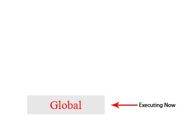

### 前言

​	javascript是一门单线程的非阻塞的脚本语言。最基本的用途就是与浏览器交互。

单线程--基于该用途，使得javascript不可能成为多线程，因为在浏览器中，我们需要对各种各样的dom操作，单线程确保了一次只能对dom进行一次操作，假若javascript是一门多线程语言，就有可能遇到多个线程对同一个dom进行操作，一个往其中添加事件，一个删除了这个dom，这时就会出现bug。

javascript的另一个特点就是非阻塞，至于javascript是如何做到非阻塞的呢，答案就是本文要记录的---event loop（事件循环）


### 正文

#### 1、执行栈与事件队列

当javascript代码执行的时候会将不同的变量存于内存中的不同位置：堆（heap）和栈（stack）中来加以区分。

堆(heap)：存放着一些对象

栈(stack)：存放着一些基础类型变量以及对象的指针

**注意：执行栈和上面的栈的意义有所不同**

##### 		（1）、执行栈

当我们在调用一个方法是，js会生成一个与这个方法对应的执行环境（context），也叫执行上下文。这个执行环境中存在着这个方法的私有作用域、上层作用域的指向、方法的参数、作用域中定义的变量以及这个作用域的this对象。而当一系列方法被依次调用的时候，由于js是单线程的，一次只能执行一个方法，于是这些方法被排在了一个单独的地方---执行栈。

当一个js被第一次执行的时候，js引擎会解析这段代码，并将其中的同步代码按照执行顺序加入执行栈中，然后从头开始执行。如果这个执行的是一个方法，那么js会往执行栈中添加这个方法的执行环境，然后进入这个执行环境继续执行其中代码。当这个执行环境中的代码执行完毕并返回结果后，js会推出这个执行环境并将该执行环境销毁，回到上一个方法的执行环境，这个过程会反复执行，知道执行栈中的代码全部执行完毕。

由下图显示，其中的global就是初次运行脚本时向执行栈中加入的代码：



由上图可知，一个方法执行会向执行栈中加入这个方法的执行环境，在这个执行环境中还可以调用其他方法，甚至是自己，其结果不过是在执行栈中再添加一个执行环境。这个过程可以是无限进行下去的，除非发生了栈溢出，即超过了所能使用内存的最大值。

当然上述所说的是同步代码的执行。接下就是异步的了

##### 		（2）、事件队列

js引擎在遇到一个异步事件后并不会等待其返回结果，而是将这个事件挂起，继续执行执行栈中的其他任务。当一个异步事件返回结果后，js会将这个事件加入与当前执行栈不同的另一个队列中，即事件队列。被放进事件队列中不会立即执行其回调，而是等待当前执行栈中的所有任务都执行完毕，待主线程处于闲置状态是，主线程会去查看事件队列中是否有任务。如果有，那么主线程会从中取出排在第一位的事件，并把这个事件对应的回调函数存进执行栈中，然后执行其中的同步代码，如此反复，就形成了一个无限的循环，这就是事件循环


图中的stack表示我们所说的执行栈，web apis则是代表一些异步事件，而callback queue即事件队列。


#### 2、macro task与micro task

以上的事件循环过程是一个宏观的表述，实际上因为异步任务之间并不相同，因此他们的执行优先级也有区别。不同的异步任务被分为两类：微任务（micro task）和宏任务（macro task）。

以下事件属于宏任务：

- `setInterval()`
- `setTimeout()`

以下事件属于微任务：

- `new Promise()`
- `new MutaionObserver()`

前面我们介绍过，在一个事件循环中，异步事件返回结果后会被放到一个任务队列中。然而，根据这个异步事件的类型，这个事件实际上会被对应的宏任务队列或者微任务队列中去。并且在当前执行栈为空的时候，主线程会 查看微任务队列是否有事件存在。如果不存在，那么再去宏任务队列中取出一个事件并把对应的回到加入当前执行栈；如果存在，则会依次执行队列中事件对应的回调，直到微任务队列为空，然后去宏任务队列中取出最前面的一个事件，把对应的回调加入当前执行栈...如此反复，进入循环。

我们只需记住**当当前执行栈执行完毕时会立刻先处理所有微任务队列中的事件，然后再去宏任务队列中取出一个事件。同一次事件循环中，微任务永远在宏任务之前执行**。

举个例子：

```javascript
setTimeout(function () {
    console.log(1);
});

new Promise(function(resolve,reject){
    console.log(2)
    resolve(3)
}).then(function(val){
    console.log(val);
})

//2
//3
//1
```

原文来源：[详解JavaScript中的Event Loop（事件循环）机制](https://zhuanlan.zhihu.com/p/33058983)


事件循环补充

宏任务(macro-task)：包括整体代码script、setTimeout、setInterval、MessageChannel、postMessage、setImmediate。

 微任务(micro-task)：Promise、process.nextTick、MutationObsever。

循环机制--不同类型的任务会进入对应的Event Queue，比如setTimeout和setInterval会进入相同(宏任务)的Event Queue。而Promise和process.nextTick会进入相同(微任务)的Event Queue。

大致执行顺序

1. 「宏任务」、「微任务」都是队列，一段代码执行时，会先执行宏任务中的同步代码。
2. 进行第一轮事件循环的时候会把全部的js脚本当成一个宏任务来运行。
3. 如果执行中遇到setTimeout之类宏任务，那么就把这个setTimeout内部的函数推入「宏任务的队列」中，**下一轮宏任务**执行时调用。
4. 如果执行中遇到 promise.then() 之类的微任务，就会推入到「**当前宏任务**的微任务队列」中，在**本轮宏任务**的同步代码都执行完成后，依次执行所有的微任务。
5. 第一轮事件循环中当执行完全部的同步脚本以及微任务队列中的事件，这一轮事件循环就结束了，开始第二轮事件循环。
6. 第二轮事件循环同理先执行同步脚本，遇到其他宏任务代码块继续追加到「宏任务的队列」中，遇到微任务，就会推入到「当前宏任务的微任务队列」中，在本轮宏任务的同步代码执行都完成后，依次执行当前所有的微任务。
7. 开始第三轮，循环往复...

例子

```javascript
//setTimeout -- 宏任务 暂不执行--推进宏任务队列中
setTimeout(function() {
    console.log('4')
})
// new Promise --立即执行 promise.then函数分配到微任务中
new Promise(function(resolve) {
    console.log('1') // 同步任务
    resolve()
}).then(function() {
    console.log('3')
})
//顺序执行
console.log('2')
//这里有留意的是Promise.then()里面的方法才会被推进微任务队列中，所以执行顺序为1-2-3-4
```


### async/await

关键来了

当函数中运用到async/await后事件循环就变得不同了

在分析事件循环前先讲讲什么是async/await

#### async/await是什么？

我们创建了 promise 但不能同步等待它执行完成。我们只能通过 then 传一个回调函数这样很容易再次陷入 promise 的回调地狱。

实际上，async/await 在底层转换成了 promise 和 then 回调函数。也就是说，这是 promise 的语法糖。每次我们使用 await, **<u>解释器都创建一个 promise 对象，然后把剩下的 async 函数中的操作放到 then 回调函数中</u>**。async/await 的实现，离不开 Promise。从字面意思来理解，async 是“异步”的简写，而 await 是 async wait 的简写可以认为是等待异步方法执行完成。

举个例子

```javascript
function aa(){
    
}
let asyFn = async ()=>{
	console.log(666)
	await aa()
    //await后面的操作全放在了promise的then函数中了
    console.log(77)
}
//等价于
let proFn = ()=>{
    return new Promise((resolve)=>{
        console.log(666)
        resolve()
    })
}
proFn().then(res=>{
    console.log(77)
})
```

#### async/await用来干什么？

用来优化 promise 的回调问题，被称作是异步的终极解决方案。 -- 解决回掉地狱

#### async/await内部做了什么？

async 函数会返回一个 Promise 对象，如果在函数中 return 一个直接量（普通变量），async 会把这个直接量通过 Promise.resolve() 封装成 Promise 对象。如果你返回了promise那就以你返回的promise为准。 await 是在等待，等待运行的结果也就是返回值。await后面通常是一个异步操作（promise），但是这不代表 await 后面只能跟异步操作 await 后面实际是可以接普通函数调用或者直接量的。

#### await的等待机制？

如果 await 后面跟的不是一个 Promise，那 await 后面表达式的运算结果就是它等到的东西；如果 await 后面跟的是一个 Promise 对象，await 它会“阻塞”后面的代码，等着 Promise 对象 resolve，然后得到 resolve 的值作为 await 表达式的运算结果。但是此“阻塞”非彼“阻塞”这就是 await 必须用在 async 函数中的原因。async 函数调用不会造成“阻塞”，**它内部所有的“阻塞”都被封装在一个 Promise 对象中异步执行。（这里的阻塞理解成异步等待更合理）**

#### async/await在使用过程中有什么规定？

每个 async 方法都返回一个 promise 对象。await 只能出现在 async 函数中。

#### async/await 在什么场景使用？

单一的 Promise 链并不能发现 async/await 的优势，但是如果需要处理由多个 Promise 组成的 then 链的时候，优势就能体现出来了（Promise 通过 then 链来解决多层回调的问题，现在又用 async/await 来进一步优化它）。

#### async/await的运行机制

大致方法：

1. async定义的是一个Promise函数和普通函数一样只要不调用就不会进入事件队列。
2. async内部如果没有主动return Promise，那么async会把函数的返回值用Promise包装。
3. await关键字必须出现在async函数中，await后面不是必须要跟一个异步操作，也可以是一个普通表达式。
4. 遇到await关键字，await右边的语句会被立即执行然后**await下面的代码进入等待状态，等待await得到结果**。 await后面如果不是 promise 对象, **await会阻塞后面的代码，先执行async外面的同步代码，同步代码执行完，再回到async内部**，把这个非promise的东西，作为 await表达式的结果。 **await后面如果是 promise 对象，await 也会暂停async后面的代码，先执行async外面的同步代码**，等着 Promise 对象 fulfilled，然后把 resolve 的参数作为 await 表达式的运算结果。

例子

```javascript
setTimeout(function () {
  console.log('6')
}, 0)
console.log('1')
async function async1() {
  console.log('2')
  await async2()
  console.log('5')
}
async function async2() {
  console.log('3')
}
async1()
console.log('4')

//最终结果
1-2-3-4-5-6
```

1. 6是宏任务在下一轮事件循环执行
2. 先同步输出1，然后调用了async1()，输出2。
3. await async2() 会先运行async2()，5进入等待状态。
4. 输出3，这个时候先执行async函数外的同步代码输出4。
5. 最后await拿到等待的结果继续往下执行输出5。
6. 进入第二轮事件循环输出6。

例子2

```javascript
console.log('1')
async function async1() {
  console.log('2')
    //由于await后面并不是promise对象，因此会将后面的代码推进微任务中，然后再执行asyn外面的代码
  await 'await的结果'
  console.log('5')
}

async1()
console.log('3')

new Promise(function (resolve) {
  console.log('4')
  resolve()
}).then(function () {
  console.log('6')
})
//结果 1-2-3-4-5-6
```

```javascript
async function async1() {
  console.log('2')
  await async2()
  console.log('7')
}

async function async2() {
  console.log('3')
}

setTimeout(function () {
  console.log('8')
}, 0)

console.log('1')
async1()

new Promise(function (resolve) {
  console.log('4')
  resolve()
}).then(function () {
  console.log('6')
})
console.log('5')

//执行结果
1-2-3-4-5-6-7-8
//1.同步代码先执行1，然后进入async1中输出2
//2.因为遇到了await因此代码进入async2中，并将7终止执行
//3.执行完async2输出3后跳出async函数并执行后面同步代码
//4.输出4后将6推到微任务队列中
//5.输出5后宏任务执行完了，执行微任务，并将6输出
//6.到处就返回async1中继续执行代码输出7
//6.最终执行8


//值得一提的是
//在谷歌浏览器输出的结果是12345768，7和6的输出顺序互换了，这是因为谷歌在73版本后修改了判断规则导致的
```

资料来源：[从event loop到async await来了解事件循环机制](https://juejin.im/post/5c148ec8e51d4576e83fd836)

