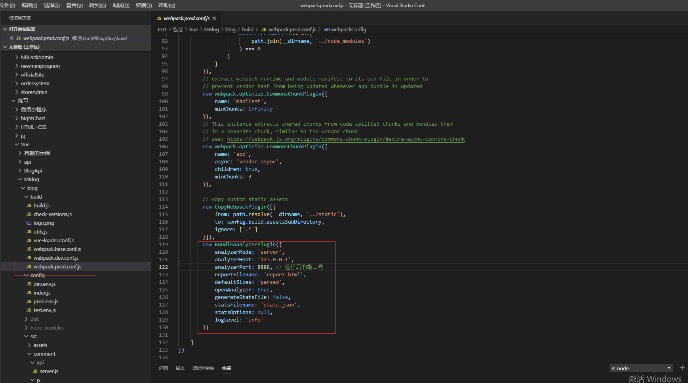
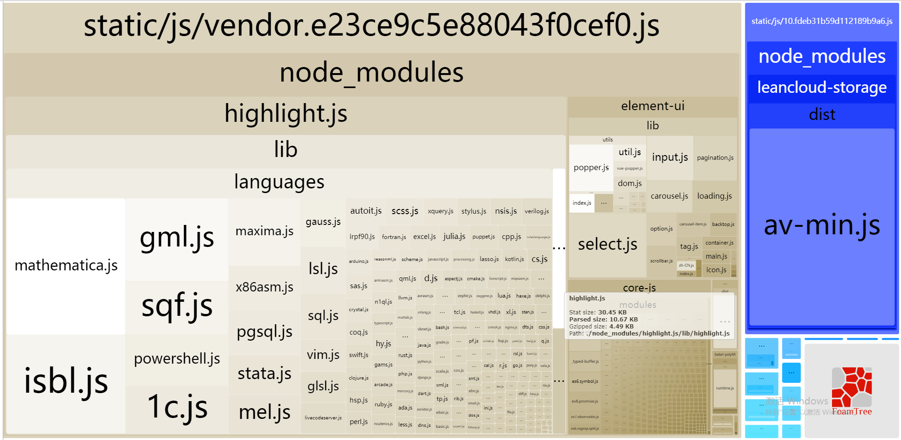
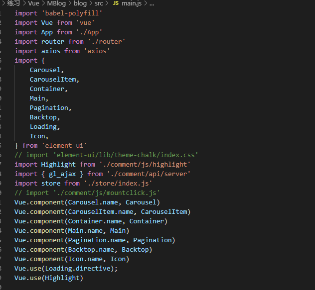
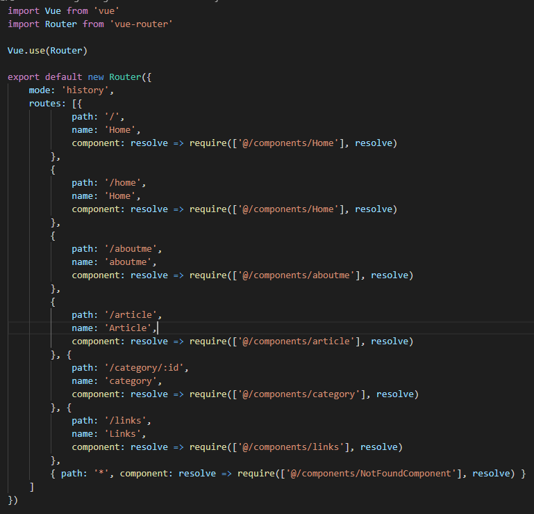
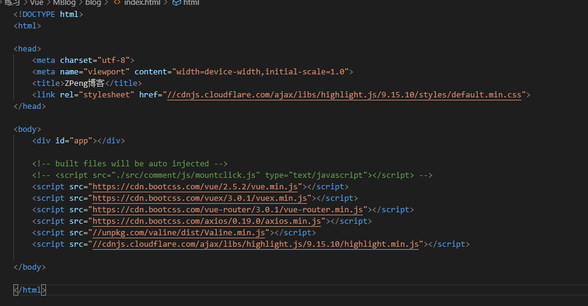
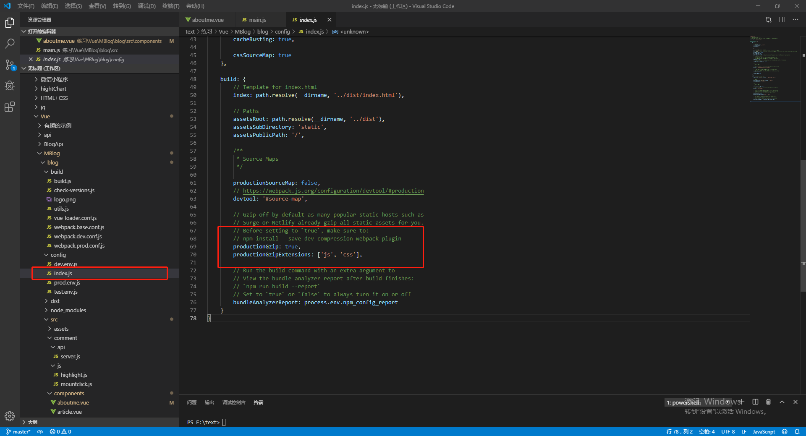

> 背景：当vue的项目在上线后，由于各种原因导致第一次加载时过慢，因此需要通过各种方法解决该问题

### 1.解决思路

​	1.压缩代码和图片

​	2.组件和图片按需加载

​	3.通过cdn引入资源，避免将其直接打包

​	4.通过gzip搭配服务器压缩代码（重点）

​		

### 2.解决方法

#### 	1.了解项目所有包的占比

​		运用一款打包分析工具Webpack Bundle Analyzer来清晰得了解项目包的情况

​		安装：	

```npm
npm install --save-dev webpack-bundle-analyzer //npm安装
yarn add -s webpack-bundle-analyzer -D//yarn 安装
```

​		配置：

​			通常在webpack.prod.conf.js中实现配置

 配置代码为：

```javascript
new BundleAnalyzerPlugin({
    analyzerMode: 'server',
    analyzerHost: '127.0.0.1',
    analyzerPort: 8888, // 运行后的端口号
    reportFilename: 'report.html',
    defaultSizes: 'parsed',
    openAnalyzer: true,
    generateStatsFile: false,
    statsFilename: 'stats.json',
    statsOptions: null,
    logLevel: 'info'
})
```

当项目build后会出现一个页面，其中包含各种的占比和其大小，根据该图能针对不同的包进行操作。




#### 	2.element-ui的按需加载

​		当element-ui全局引入时，打包出来的文件十分大，因此要按需引入

​		但想对element-ui按需加载需要需要组件来帮助[babel-plugin-component](https://github.com/QingWei-Li/babel-plugin-component)

​		首先，安装 babel-plugin-component：

```npm
npm install babel-plugin-component -D
```

​		然后，将 .babelrc 修改为：

```javascript
{
  "presets": [
    ["es2015", { "modules": false }]
  ],
  "plugins": [["component", [
    {
      "libraryName": "element-ui",
      "styleLibraryName": "theme-chalk"
    }
  ]]]
}
```

如果你只希望引入部分组件

```javascript
import Vue from 'vue'
import { Button, Select } from 'element-ui'
import App from './App.vue'

Vue.component(Button.name, Button)
Vue.component(Select.name, Select)
/* 或写为
 * Vue.use(Button)
 * Vue.use(Select)
 */
```

实现效果如下：




#### 	3.组件按需加载

​		如图所示




#### 	4.cdn引入

​		在index.html中引入cdn资源

​			如图所示



​		修改 build/webpack.base.conf.js ，添加或修改externals

```javascript
externals: {
    'vue': 'Vue',
     'vue-router': 'VueRouter',
     'vuex': 'Vuex',
     'axios': 'axios' 
 },
```

​		修改src/main.js src/router/index.js 注释掉import引入的vue,vue-resource

```javascript
// import Vue from 'vue'
// import VueResource from 'vue-resource'
// Vue.use(VueResource)
```

 	 

#### 		5.gzip压缩（关键）

​		通过gzip压缩，能将打好的包压缩到原来的1/3，gzip分为2部分，需要服务器配合

​		先安装 compression-webpack-plugin 插件

```
npm  i compression-webpack-plugin -save-dev
//或者
yarn -D compression-webpack-plugin
```

​		然后再webpack.prod.conf.js中配置	

```javascript
 webpackConfig.plugins.push(
        new CompressionWebpackPlugin({
            asset: '[path].gz[query]',
            algorithm: 'gzip',
            test: new RegExp(
                '\\.(' +
                config.build.productionGzipExtensions.join('|') +
                ')$'
            ),
            threshold: 10240,
            minRatio: 0.8
        })
    )
```

最后在config/index.js中将productionGzip设置为true就可以了




​	然后到了服务器配置了，我用的node作为服务器运行，因此讲下如何配置node的

​		1.express

​			先安装一个依赖

```
npm install compression --save
```

​			然后在文件中配置以下代码

```javascript
var compression = require('compression')
var app = express();
// 启用gzip
app.use(compression());
```

​			这样gzip就可以跑起来了


​		2.koa

​			安装koa-compress中间件

```
npm install koa-compress --save
```

​			配置koa-compress中间件

```javascript
const koa = require('koa');
const compress = require('koa-compress');
const app = koa();
const options = { threshold: 2048 };
app.use(compress(options));
```


至此，vue项目的首屏优化就到这里了，剩余还有的是请求优化等一系列操作了，不过我还没来得及改，就不写了。

最后介绍一个比较好用的测试网站性能的在线网站，可以用于测试网站性能。

GTmetrix:https://gtmetrix.com/